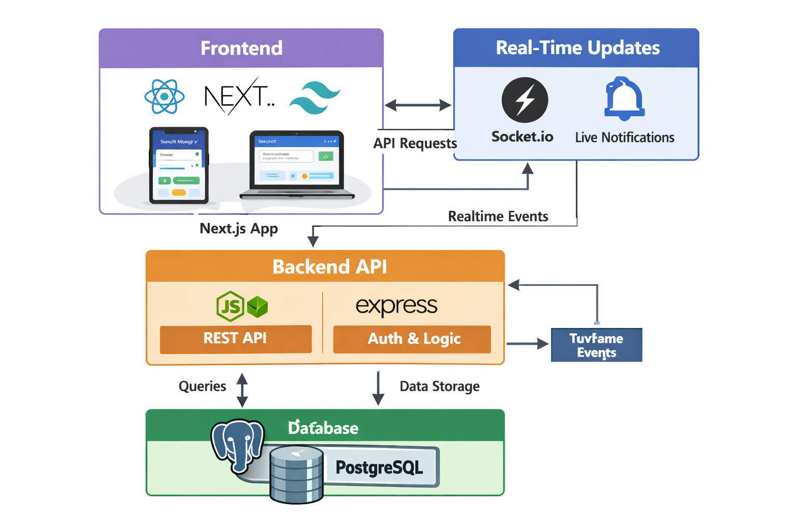

<div align="center">

# 💸 PayFlow – Full Stack Digital Wallet System

Your modern digital payment solution enabling seamless transactions with real-time updates and secure authentication.


</div>

---

## 🚀 Live Demo

👉 https://payflow-frontend-ten.vercel.app/

---

## 📌 About the Project

**PayFlow** is a full-stack fintech application designed to simulate real-world digital payment systems. It allows users to securely send, receive, and request money using multiple identifiers such as email, mobile number, UPI ID, and QR codes.

The platform includes real-time transaction updates, analytics dashboards, and a seamless user experience similar to modern payment apps.

---

## 🏗️ System Architecture
<p align="center">
  
</p>

## 🔗 Project Repositories

### 🌐 Frontend
👉 https://github.com/DebeshPanda555/payflow-frontend

### ⚙️ Backend
👉 https://github.com/DebeshPanda555/payflow-backend

---

## 📊 GitHub Stats

| ⭐ Stars | 🍴 Forks | 🐞 Issues | 📦 Repo Size | 🔓 Open Source |
|--------|--------|--------|-----------|--------------|
|  |  |  |  | ✅ |

---

## ✨ Features

### 💸 Payment System
- Send money via **Email, Mobile Number, UPI ID**
- **QR Code scanning & payments**
- Secure wallet-to-wallet transactions

### 🔐 Security
- JWT-based authentication
- Password hashing with bcrypt
- Protected API routes

### 📊 Dashboard & Analytics
- Wallet balance tracking
- Transaction history
- Analytics using Recharts

### ⚡ Real-Time System
- Instant transaction updates
- Live notifications using Socket.io

### 📩 Payment Requests
- Request money via phone/UPI
- Accept / reject requests
- Real-time request updates

---

## 🛠️ Tech Stack

### Frontend
- Next.js
- React.js
- TailwindCSS

### Backend
- Node.js
- Express.js

### Database
- PostgreSQL

### Realtime
- Socket.io

### Authentication
- JWT
- bcrypt

### Deployment
- Vercel (Frontend)
- Render (Backend)
- Neon PostgreSQL

---
🎯 What Makes This Project Special?
	•	Real-world fintech system simulation
	•	Combines full-stack + real-time + security
	•	Supports multiple payment methods
	•	Designed with scalable architecture
	•	Production-ready deployment

⸻

👨‍💻 Author

Debesh Kumar Panda

🔗 LinkedIn:
https://www.linkedin.com/in/debesh-kumar-panda-4a299a273


## ⚙️ Installation & Setup

```bash
# Clone Frontend
git clone https://github.com/DebeshPanda555/payflow-frontend

# Clone Backend
git clone https://github.com/DebeshPanda555/payflow-backend


